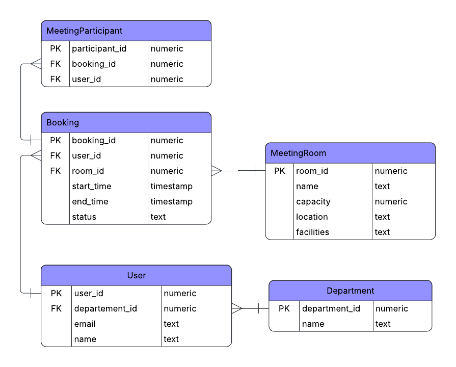

# 🏢 E-Meeting Database Design

## 📌 Deskripsi
E-Meeting adalah aplikasi untuk **memesan ruang meeting** di sebuah perusahaan.  
Database ini dirancang untuk menyimpan informasi terkait:
- User (pegawai)
- Department (divisi pegawai)
- Meeting Room (ruangan meeting)
- Booking (pemesanan ruangan)
- Meeting Participant (peserta meeting)

Tujuan utama: mempermudah manajemen booking ruang meeting supaya tidak bentrok dan semua peserta tercatat.

---

## 📂 ERD (Entity Relationship Diagram)

Entitas utama:
- **Department**
- **User**
- **MeetingRoom**
- **Booking**
- **MeetingParticipant**

Relasi:
- Satu `Department` punya banyak `User`
- Satu `User` bisa membuat banyak `Booking`
- Satu `MeetingRoom` bisa dipakai di banyak `Booking`
- Satu `Booking` bisa punya banyak `MeetingParticipant`

**

---

## 🛠️ Database Schema DDL (PostgreSQL)

```sql
CREATE TABLE Department (
    department_id SERIAL PRIMARY KEY,
    name VARCHAR(100) NOT NULL
);

CREATE TABLE "User" (
    user_id SERIAL PRIMARY KEY,
    name VARCHAR(100) NOT NULL,
    email VARCHAR(100) UNIQUE NOT NULL,
    department_id INT,
    FOREIGN KEY (department_id) REFERENCES Department(department_id)
);

CREATE TABLE MeetingRoom (
    room_id SERIAL PRIMARY KEY,
    name VARCHAR(100) NOT NULL,
    capacity INT NOT NULL,
    location VARCHAR(100),
    facilities TEXT
);

CREATE TABLE Booking (
    booking_id SERIAL PRIMARY KEY,
    user_id INT NOT NULL,
    room_id INT NOT NULL,
    start_time TIMESTAMP NOT NULL,
    end_time TIMESTAMP NOT NULL,
    status VARCHAR(20) DEFAULT 'pending',
    FOREIGN KEY (user_id) REFERENCES "User"(user_id),
    FOREIGN KEY (room_id) REFERENCES MeetingRoom(room_id)
);

CREATE TABLE MeetingParticipant (
    booking_id INT NOT NULL,
    user_id INT NOT NULL,
    PRIMARY KEY (booking_id, user_id),
    FOREIGN KEY (booking_id) REFERENCES Booking(booking_id),
    FOREIGN KEY (user_id) REFERENCES "User"(user_id)
);
```


## 🛠️ Database Schema Seeder Insert (PostgreSQL)
```sql
-- Department
INSERT INTO Department (name) VALUES 
('IT'), ('HR'), ('Finance');

-- User
INSERT INTO "User" (name, email, department_id) VALUES
('Alex', 'alex@company.com', 1),
('Budi', 'budi@company.com', 2),
('Citra', 'citra@company.com', 3);

-- MeetingRoom
INSERT INTO MeetingRoom (name, capacity, location, facilities) VALUES
('Ruang A', 10, 'Lantai 1', 'Proyektor, Whiteboard'),
('Ruang B', 20, 'Lantai 2', 'TV, AC, Speakerphone');

-- Booking
INSERT INTO Booking (user_id, room_id, start_time, end_time, status) VALUES
(1, 1, '2025-09-22 09:00:00', '2025-09-22 10:00:00', 'approved'),
(2, 2, '2025-09-22 14:00:00', '2025-09-22 15:30:00', 'pending');

-- MeetingParticipant
INSERT INTO MeetingParticipant (booking_id, user_id) VALUES
(1, 2), (1, 3),
(2, 1), (2, 3);
```
